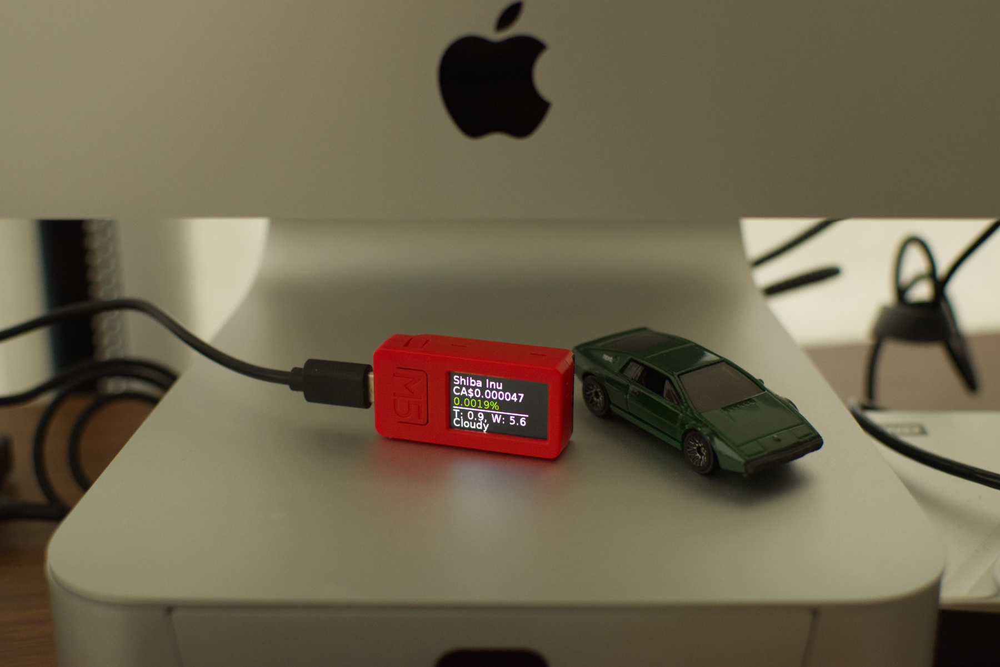
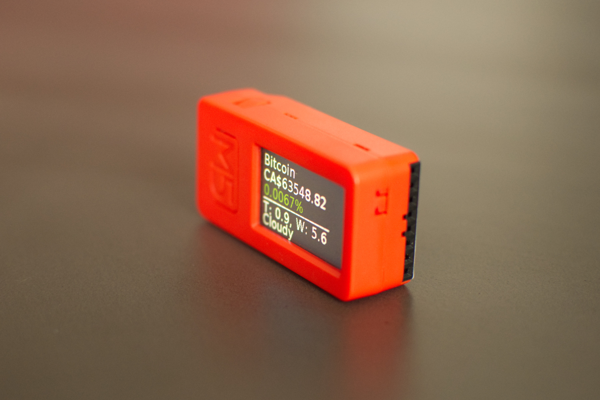
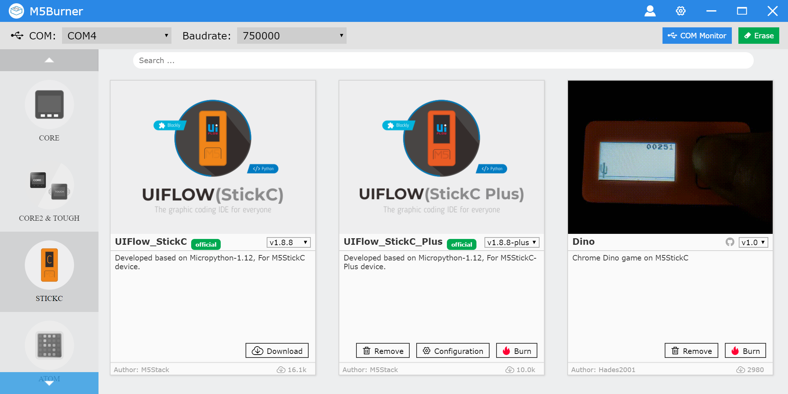
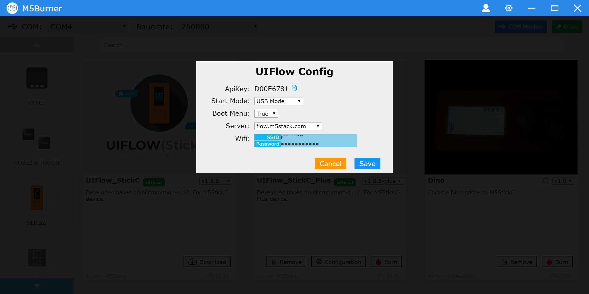
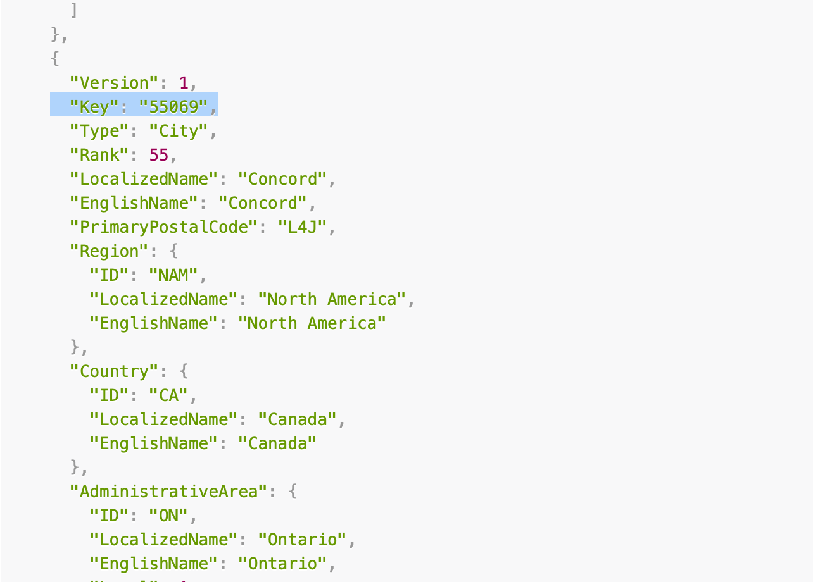

# m5-stick-c-crypto-display

A tiny program to show crypto prices on M5-StickCPlus



A while ago I came across this tiny little IoT device called M5Stick. It's pretty powerful and equipped for the size and price ($20) you pay for it, Wifi, bluetooth, microphone, speaker, LCD, a built-in battery, 6-Axis IMU and, ESP32 microcontroller, three buttons and a bunch of pins for expansion. 



Since I have a bunch of cyrpto coins I decided to use it as a dedicated display to monitor prices. Setting it up is easy. You can use their [Burner](https://shop.m5stack.com/pages/download) program to transfer your code to the device. If you are on Windows (which I recommend because their macOS app is an Electron app which is terrible) you need to download [CP2104](https://shop.m5stack.com/pages/download) USB to UART bridge virtual COM port driver from their website. 

When you open the Burner software you see this screen:



#Prepating the device to run the code

From the left pan select `STICKC` and from the right pan select `StickC Plus`. If you don't see `Configuration` you have to download the firmware first (hit Download). Now open the configuration window. There you have to set your wifi username and password so the device can use your wifi connection, and set the `Start Mode` to `USB Mode` to be able to run the code from the IDE on the device.



Now you need an IDE to write the code, they recommend Visual Studio code. If you go with it you need to download their extnsion so the VSCode can comunicate with the device. 

You can find their official extension repo and how to use it with their devices [here](https://github.com/curdeveryday/vscode-m5stack-mpy).

Once you have it ready you can use this code to have the price of three coins plus weather data on the display. I am using [nomic](https://p.nomics.com/cryptocurrency-bitcoin-api) API which supports multiple coins in a single call and also supports currency conversion if you like to have the prices in your local currency rather than USD. 

For the weather part I am using [AccuWeather](https://developer.accuweather.com).  A small note on this, you can use [this API](https://developer.accuweather.com/accuweather-locations-api/apis/get/locations/v1/cities/search) to get the `PLACE_KEY` value for your location. In the API response it's called `Key`, the highlighted line in the image below:



#Code

```python
from m5stack import *
import urequests, network, json, machine, time
from micropython import const


p1 = machine.Pin(27)
p1.init(p1.OUT)
p1.value(1)
tcounter = 0

sta_if = network.WLAN(network.STA_IF)
sta_if.active(True)
if not sta_if.isconnected():
    # Set your WiFi SSID and password here
    sta_if.connect('[WIFI_NAME]]', '[WIFI_PASSWORD]')
    while not sta_if.isconnected():
        utime.sleep(1)

lcd.clear() 
# Setting the display mode to landscape
lcd.orient(lcd.LANDSCAPE)
lcd.fill(0x000000)

symbols = []
prices = []
changes = []
currentTemp = ""
currentWind = ""
currentWeather = ""

lcd.font(lcd.FONT_DejaVu24)

#Index to iterate through coins
index = 0

def getTemp():
    global currentTemp
    global currentWind
    global currentWeather

    response = urequests.get('http://dataservice.accuweather.com/currentconditions/v1/[PLACE_KEY]?apikey=[APIKEY]&details=true')
    parsed = response.json()
    currentTemp = str(parsed[0]["RealFeelTemperature"]["Metric"]["Value"])
    currentWind = str(parsed[0]["Wind"]["Speed"]["Metric"]["Value"])
    currentWeather = parsed[0]["WeatherText"]

def getPrices():
    global symbols
    global prices
    global changes
    global finalText

    symbols = []
    prices = []
    changes = []
    url = 'https://api.nomics.com/v1/currencies/ticker?key=[API_KEY]&ids=BTC,ENJ,DOGE,SHIB&interval=1h&convert=CAD&per-page=100&page=1'
    response = urequests.get(url)
    parsed = response.json()

for item in parsed:
        symbols.append(item["name"])
        _priceString = item["price"]
        _price = float(item["price"])
        _price = round(_price, 6)
        # I want to show 6 digits after '.' if the price is smaller than 0.0009 otherwise it will show the scientific format, 4.7e-10 kind of the text
        if _price > 0.0009:
            prices.append(_price)
        else:
            prices.append('{:.6f}'.format(_price)[0:8])
        _change = float(item["1h"]["price_change_pct"])
        changes.append(_change)

def showData():
    global index

    lcd.clear()
    lcd.print(symbols[index], 10, 10, 0xFFFFFF) 
    lcd.print('CA$'+str(prices[index]), 10, 35, 0xFFFFFF)
    _percent = round(changes[index] ,4)
    _percentColor = 0x0F6608
    if _percent < 0:
        _percentColor = 0x8B1F08

    lcd.print(str(_percent)+'%', 10, 60, _percentColor)
    lcd.print('______________',10,61)
    lcd.print('T: '+currentTemp+ ', W: ' + currentWind , 10, 90, 0xEEEEEE)
    lcd.print(currentWeather, 10, 110, 0xEEEEEE)
    if index < len(symbols) - 1:
        index += 1
    else:
        index = 0    

def count(timer):
    global tcounter
    if tcounter & 1:
        p1.value(0)
    else:
        p1.value(1)
    tcounter += 1
    # Refresh display every 5 seconds
    if (tcounter % 5) == 0:
        showData()
    # Refresh price data every 10 minutes
    if (tcounter % 600) == 0:
        getPrices()
    # Refresh weather data every hour
    if (tcounter % 3600) == 0:
        tcounter = 0
        getTemp()
    
getPrices()
getTemp()
showData()

timer = machine.Timer(2)
timer.init(period=1000, mode=timer.PERIODIC, callback=count)

```

In the nomic API call if you notice I have put 4 coins in front of `ids` and set `convert` to `CAD` to get the prices in Canadian Dollar, if you remove conver you  will get them in USD. to get different coins use their website to find out which ones are supported. 

[](http://www.youtube.com/watch?v=lyZ6PpzQQWk "M5Stick C Plus showing cryptocoin prices")
